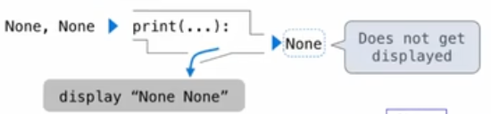
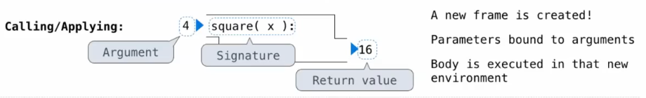
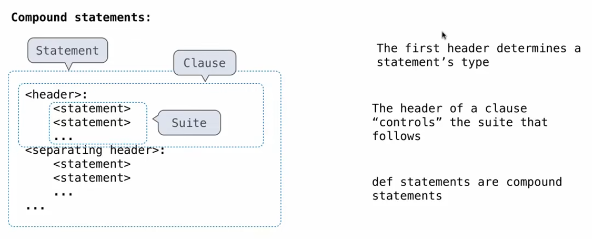

# Control

## None

- None represents "nothing"
- a functino does not explicitly return a value will return None
- None is not displayed by the interpreter as the value of an expression. None 作为表达式的值时不会被解释器显示

```py
>>> def f(x):
...     x * x
... 
>>> f(4)
>>> mind = f(4)
>>> mind
>>> 
```

## pure functions & non-pure functions

pure functions: just return values


non-pure functions: have side effects. print() is also a side effects

```py
>>> print(print(1), print(2))
1
2
None None
```




## multiple environments

- def statement
```py
def square(x):
    return mul(x, x)
```
formal parameter(形式参数): `x`
return expression: `mul(x, x)`
body(return statement): `return mul(x, x)`

- call expression: 
```py
square(2 + 2)
```
operand(操作数): 2 + 2
argument(实参): 4
operator(运算符): square
function: func square(x)

- calling/applying



every expression is evaluated in the context of an environment

a name evaluates to the value bound to that name in the earliest frame of the current environment which that name is found
一个名称的求值结果是当前环境中最早找到该名称的帧中与该名称绑定的值。


## python


doctest:

```py
from operator import truediv, floordiv, mod
def divide(n, d):
    """function:
    >>> q, r = divide(2013, 10)
    >>> q
    201
    >>> r
    3
    """
    return floordiv(n, d), mod(n, d)
```
```shell
(base) petunia@petuniadeMacBook-Pro HW % python -m doctest hw1.py
(base) petunia@petuniadeMacBook-Pro HW % python3 -m doctest -v hw1.py
Trying:
    q, r = divide(2013, 10)
Expecting nothing
ok
Trying:
    q
Expecting:
    201
ok
Trying:
    r
Expecting:
    3
ok
1 items had no tests:
    hw1
1 items passed all tests:
   3 tests in hw1.divide
3 tests in 2 items.
3 passed and 0 failed.
Test passed.
```

## conditional statement

compound statement


```py
def abs(x):
    if x < 0:
        return -x
    elif x == 0:
        return 0
    else:
        return x
```

```py
x = 2
def f():
    print(x)  """Error! local variable 'x' referenced before assignment"""
    x = 121
    print(x)
f()   
```


assert statement for debug:

```py
def area_square(r):
	assert r > 0, 'a length must be positive'
	return r * r
```

