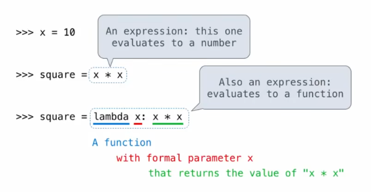

# design functions

characteristics of functions:

- a function's domain is the set of all inputs it might possibly take as arguments
- a function's range is the set of output values it might possibly return
- a pure function's behavior is the relationship it creates between input and output

guidance:

- give each function exactly one job
- don't repeat yourself. implement a process just once, but execute it many times
- define functions generally

# higher-order functions

higher-order function: a function that takes a function as an argument value or returns a function as a return value

- express general methods of computation
- remove repetition from programs
- separate concerns among functions

## generalization

```py
def identity(k):
	return k

def cube(k):
	return pow(k, 3)

def summation(n, term):
	total, k = 0, 1
	while k <= n:
		total, k = total + term(k), k + 1
	return total

def sum_naturals(n):
	return summation(n, identity) 

def sum_cubes(n):
	return summation(n, cube) 
```

## function as return value

```py
def make_adder(n):
        """return a function that takes one argument k and return k + n.
        >>> add_three = make_adder(3)
        >>> add_three(4)
        7
        """
        def adder(k):
                return k + n
        return adder

>>> make_adder(192)(1)
193
>>> f = make_adder(192)
>>> f(12)
204
```

# lambda expression

```py
>>> (lambda x : x * x)(3)
9
>>> square = lambda x : x * x
>>> square(12)
144
```

```py
    lambda         x        :      f(g(x))
a function that takes x and return f(g(x))
```




---


# recursive functions

A function is called recursive if the body of the function calls the function itself, either directly or indirectly.

```py
>>> def sum_digit(n):
...     if n < 10:
...             return n
...     else:
...             all_but_last, last = n // 10, n % 10
...             return sum_digit(all_but_last) + last
... 
>>> sum_digit(111)
3
```

## mutual recursion(互递归)

get pepples

```py
>>> def play_alice(n):
...     if n == 0:
...             print("Bob wins!")
...     else:
...             play_bob(n-1)
... 
>>> def play_bob(n):
...     if n == 0:
...             print("Alice wins!")
...     elif is_even(n):
...             play_alice(n - 2)
...     else:
...             play_alice(n - 1)
```

## tree recursion

tree recursion, in which a function calls itself more than once.

```py
>>> def fib(n):
...     if n == 1:
...             return 0
...     if n == 2:
...             return 1
...     else:
...             return fib(n-2) + fib(n-1)
```

We can think of a tree-recursive function as exploring different possibilities.

```py
>>> def count_partitions(n, m):
        """Count the ways to partition n using parts up to m."""
        if n == 0:
            return 1
        elif n < 0:
            return 0
        elif m == 0:
            return 0
        else:
            return count_partitions(n-m, m) + count_partitions(n, m-1)
```

## logical operators

```py
<left> and/or <right>
```

- evaluate the subexpression `<left>`
- if the result is a false value v, then the expression evaluates to v
- otherwise, the expression evaluates to the value of the subexpression `<right>`

```py
<consequent> if <predicate> else <alternative>
```

equals to:

```cpp
<predicate> ? <consequent> : <alternative>
```

```py
>>> x = 0
>>> abs(1/x if x != 0 else 0)
0
```
