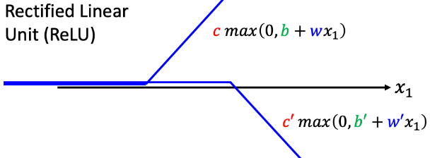

# Introduction

index
- 基本术语
- 深度学习的基本流程

learning algorithm（学习算法）：从数据中得出。给学习算法旧的经验数据，它能产生模型

model: 面对新数据时，它能给予我们相应的结果。

data set：数据集。eg (height=180, weight=50, age = 18),
(height=190, weight=40, age = 17)，...

instance/sample（示例/样本）：对于一个事物的描述。eg (height=180, weight=50, age = 18)

attribute/feature（属性/特征）：反映事物在某一方面的性质。eg height、weight

attribute value（属性值）：属性的取值。eg 180

attribute space/sample space（属性空间/样本空间）：属性张成的空间

feature vector（特征向量）：示例的别称

dimensionality(维数)


bias(偏差): 模型的**精准度**。     反映模型在样本上的输出与 真实值      之间的误差

variance(方差)：即模型的**稳定性**。反映模型在样本上的输出与 模型输出期望 之间的误差

high bias + low variance：

training sample: 训练样本

learning/training 学习/训练：从数据中学得模型

training data：训练数据

training sample：训练样本

training set：训练集，由训练样本组成的集合

prediction（预测）：training sample的“好坏”信息。eg （(height=180, weight=50, age = 18)，njuer）

label（标记）：eg 上文的njuer

example（样例）：有着“好坏”信息的sample

sample + njuer = example

label space（标记空间/输出空间）：(xi, yi)表示第i个样例。yi为xi 的标记，则yi构成的集合为标记空间

batch(批次): 将数据分割成较小的批次来处理。一个批次中包含的样本数位batch size
epoch(轮次): 完成一次训练的次数

```
N = 10000
Batch size = 1000
=> in 1 epoch, there is 10 updates 
```

hidden layers(隐藏层)：除输入层和输出层之外的层。隐藏层不直接接受外界信号，也不直接向外界发送信号，仅仅当数据被非线性分离时才需要。

overfitting(过拟合)：模型为训练数据提供准确的预测，但遇到新数据时预测不准。

区分classification和regression，主要看他们预测的值是「离散」的还是「连续」的。

classification(分类)：预测的是离散值。eg：好，坏

regression(回归)：预测的是连续值。好坏程度：0.00～1.00

binary classification(二分类)：只涉及两个类别。称为positive class(正类)和negative class(反类)

multi-class classification(多分类)

testing: 获得模型后，用它来预测的过程

testing sample(测试样本)：被预测的样本

clustering(聚类)：将训练集中的数据分为若干组，每一组称为cluster(蔟)

学习任务分为：
- supervised learning(监督学习)：有label。例如，分类和回归
- unsupervised learning(无监督学习)：没有label。例如，聚类

generalization(泛化)：模型适用于新样本

distribution(分布)

independent and identically distributed i.i.d(独立同分布)

inductive learning(归纳学习/概念学习)： 从一般现象归纳得到概念

inductive bias（归纳偏好）：学习算法在学习过程中对某种类型假设的偏好。算法的价值观有很多，例如`occam's razor(奥卡姆剃刀)：选最简单的`

pre-supervised learning
	pre-train：using unlabeled images to develop general purpose knowledge

downstream tasks: 将预训练模型应用于具体的实际任务

generative adversarial network: 寻找集合x与集合y之间的function

reinforcement learning: not know how to label, but know the results are good or bad. eg. chess

anomaly detection: 异常检测

explainable AI: 回答原因
  
model attack

domain adaptation

network compression

meta learning: learn how to learn
/ few-shot learning

threshold: 下限、閾
什麼樣

regression: the function outputs a scalar

classification: given options, the function outputs the correct one

structured learning: creating something with structure(image, document)

NFL定理（No Free Lunch Theorem）：所有学习算法的误差相同


1. **function with unknown parameters**

```
model: y = b + wx
feature: y x
w: weight
b: bias
```

2. **define loss from training data**

Loss: a function, how good a set a of values(b = ..., w = ...) is
L(b, w)

MAE: mean absolute error
MSE: mean square error

$$
\begin{split}
y: 估测值 \\ \hat{y}:实际值 \\
e=|y-\hat{y}| \quad MAE \\
e=(y-\hat{y})^2 \quad MSE \\
Loss: \quad L= \frac{1}{N}\sum_n{e_n}
\end{split} 
$$

error surface(误差曲面): 表示误差如何随模型的参数的变化而变化


3. **optimization**

gradient descent(梯度下降): 


hyperparameters(超参数): 由自己设置的参数

$\eta$ : learning rate

linear model
$$
\begin{split}
    y=b+wx \\
    y=b+\sum_{j=1}^{7}{w_j x_i}    \\
    ...
\end{split}
$$


model bias: 模型的限制

piecewise linear function(分段线性函数)


**sigmoid function**

$$y=c \frac{1}{1+e^{-(b+wx_{1})}}=c*sigmoid(b+wx_1)$$


1. functions with unknown

$$
y=b+c^T\sigma(b+Wx)
$$

推导过程


2. define loss from training data

$$
e=\hat{y}-y
L=\frac{1}{N}\sum{e_n}
$$


3. optimization


activation function(激活函数): sigmoid、max

rectified linear(ReLU): 分段线性函数，所有负值为0，正值不变

$$
ReLU(x)=\begin{cases}
    x &\text{if }x>0
    0 &\text{if }x<=0
\end{cases}
$$




