# What to do if my network fails to train

index
- 基本术语
- 常用方法

critical point(驻点): 所有一阶偏导数都为零（梯度向量为零向量）的点

local minima(极小值/局部最值)

saddle point(鞍点):沿着某一方向是稳定的，另一条方向是不稳定的奇点

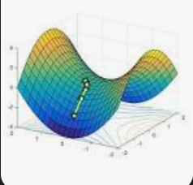

Hessian(黑塞矩阵/黑塞式(行列式))：由一个多变量函数的所有二阶偏导数组成的方阵，或其行列式
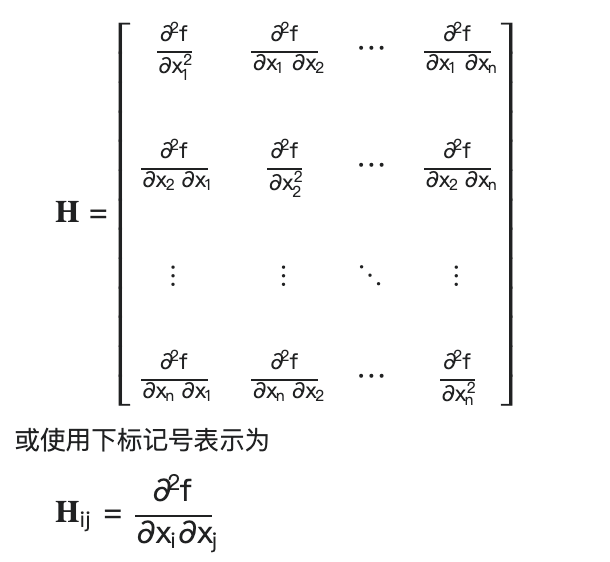

gradient(梯度)：一个曲面沿着给定方向的倾斜程度

## how to discriminate local minima and saddle point?

h: hessian
g: gradient
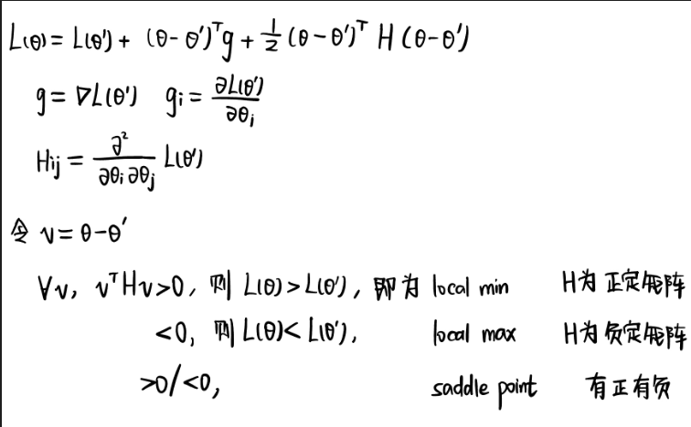

- H is positive definite: local min
- H is negative definite: local max
- eigen value sometimes are positive, sometimes are negative: saddle point

by calculating the eigen vector of H (u), we can update the parameter along the direction of u

when parameters are high, local minima is rare

### batch（批次）& momentum（動量）

large batch v.s. small batch

- large batch is more accurate, small batch is more noisy
- large batch require less time to compute gradient, more efficient!
- smaller batch size has better performance, noisy update is better for training

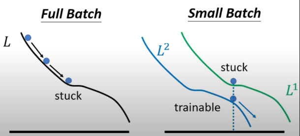
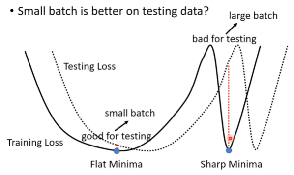
the minima on the plain(flat minima) is better than the minima in the canyon(sharp minima).
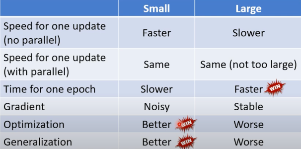

### gradient descent + momentum

movement = (movement of last step)- (gradient at present)

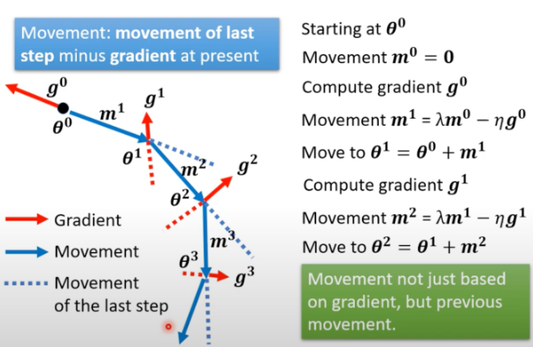
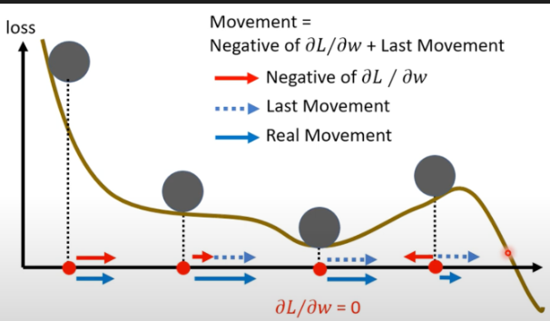

**momentum can help escape critical points**:
when reaching the critical point, although the gradient descent stops, the movement will let loss continue to update. 
and even when the gradient descent tell you to move left, but movement tell you to move right, and movement is larger than the gradient, then loss will update to the right, the direction of momentum.

### adaptable learning rate自适应学习率

1. Adaptive Gradient Algorithm (Adagrad):an algorithm for gradient-based optimization. 对低频出现的参数进行大的更新，对高频出现的参数进行小的更新。适合于处理稀疏数据。

$$
\begin{split}
\theta_i^{t+1}\gets\theta_i^t-\frac{\eta}{\sigma_i^t}g_i^t\\
\sigma_i^t=\sqrt{\frac{1}{t+1}\sum_{i=0}^{t}(g_i^t)^2}
\end{split}
$$

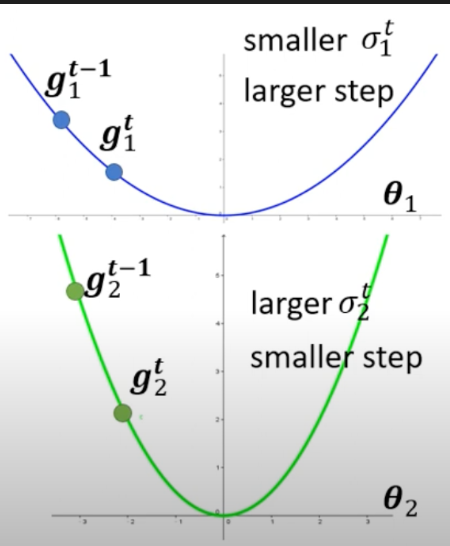

2. RMSProp(Root Mean Square Prop)

the recent gradient has larger influence, while the past gradients have less influence.

$$
\begin{split}
\theta_i^{t+1}\gets\theta_i^t-\frac{\eta}{\sigma_i^t}g_i^t\\
\sigma_i^t=\sqrt{\alpha(\sigma_i^{t-1})^2+(1-\alpha)(g_i^t)^2}\\
\alpha :hyperparameter,0<\alpha<1
\end{split}
$$

3. Adam: RMSProp + Momentum

learning rate scheduling:

- learning rate decay: as the training goes, we are closer to the destination, so we reduce the learning rate.
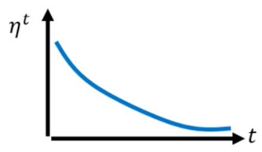
- warm up: increase and then decrease
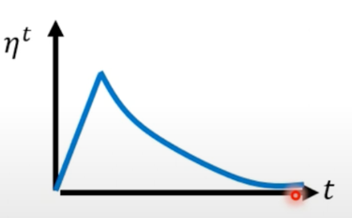

## classification

ont-hot vector(独热编码)：变量用二进制向量来表示

$$
\hat y=\begin{bmatrix}
    1 \\ 0 \\ 0
\end{bmatrix}
$$

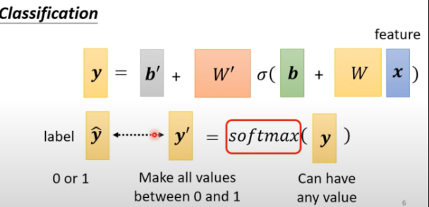

softmax(归一化指数函数): y(any value) -> y'(0 ~ 1)

$$
\begin{split}
exp(x)=e^x\\
y_i'=\frac{exp(y_i)}{\sum{exp(y_i)}}
\end{split}
$$
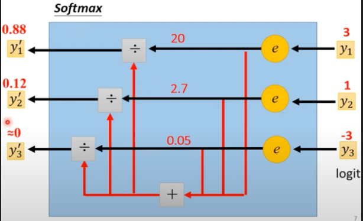

### loss of classification

cross-entropy loss(交叉熵损失): 刻画实际输出（概率）与期望输出（概率）的距离。其值越小，两个概率分布就越接近，即拟合的更好。

$$
e=-\sum_i\hat{y}_ilny_i'
$$

Maximum Likelihood Estimation, MLE(最大似然估计)：

首先定义似然函数：
$$
L(\theta)=\prod_{i=1}^N p(y_i|x_i;\theta)
$$

对数似然函数：取对数，以简化计算：
$$
\log L(\theta)=\sum_{i=1}^N \log p(y_i|x_i;\theta)
$$

最大化对数似然函数：
$$
\hat \theta=\arg \max_\theta \sum_{i=1}^N \log p(y_i|x_i;\theta)
$$

**minimizing cross-entropy** is equivalent to **maximizing likelihood**
最大似然和最小化交叉熵是等价的。因为它们追求同一个目标：使得预测值与真实值之间的匹配程度最大。

## batch normalization

feature normalization（特徵歸一化）: makes gradient descent converge faster

$$
\begin{split}
\forall i:mean:m_i\quad standard\ deviation:\sigma_i
\\
\widetilde{x_i^r}\gets\frac{x_i^r-m_i}{\sigma_i}
\end{split}
$$
the means of all dims are 0, and the variances are all 1

same, we do normalization on the z.

$$
\begin{split}
\eta=\frac{1}{3}\sum_{i=1}^3z^i
\\
\sigma=\sqrt{\frac{1}{3}\sum_{i=1}^3(z^i-\eta)^2}
\\
\widetilde{z_i^r}\gets\frac{x^i-\eta}{\sigma}
\end{split}
$$
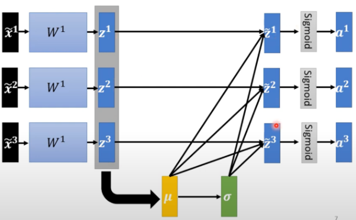

Because the network is too large, so we consider a batch once. This is the Batch Normalization.

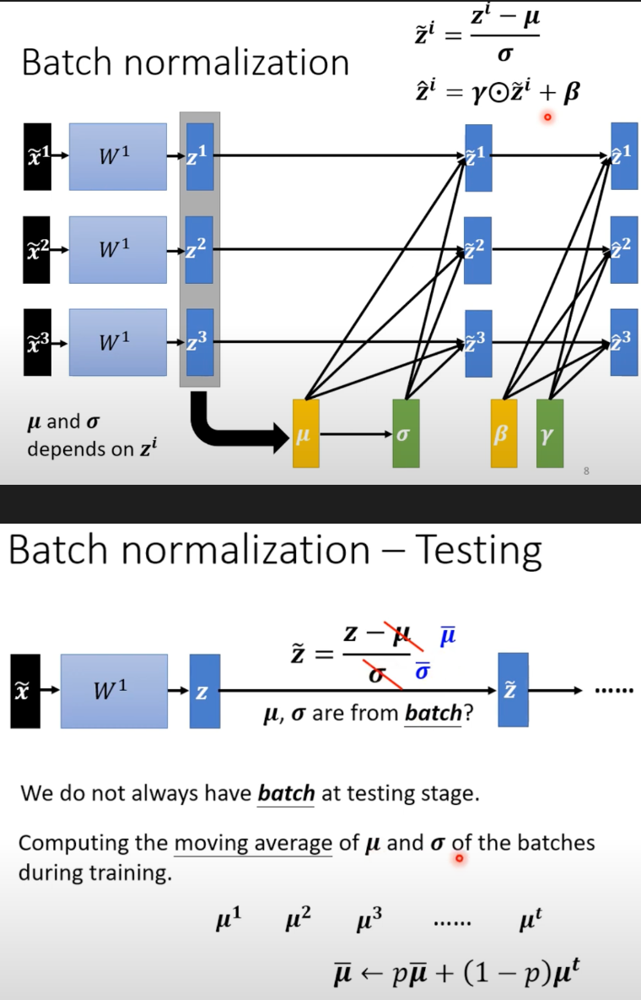

internal covariate shift

hoeffding's inequality

$$
\forall \epsilon>0,Pr(|S_n-E[S_n]|>=\epsilon)<=2exp(-\frac{2\epsilon^2}{\sum_{i=1}^n(b_i-a_i)^2})
$$

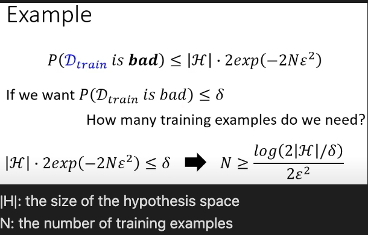

# hw

multiclass classification: framewise phoneme prediction from speech

phoneme(音素、音位): a unit of speech sound in a language that can serve to distinguish one word from the other.

