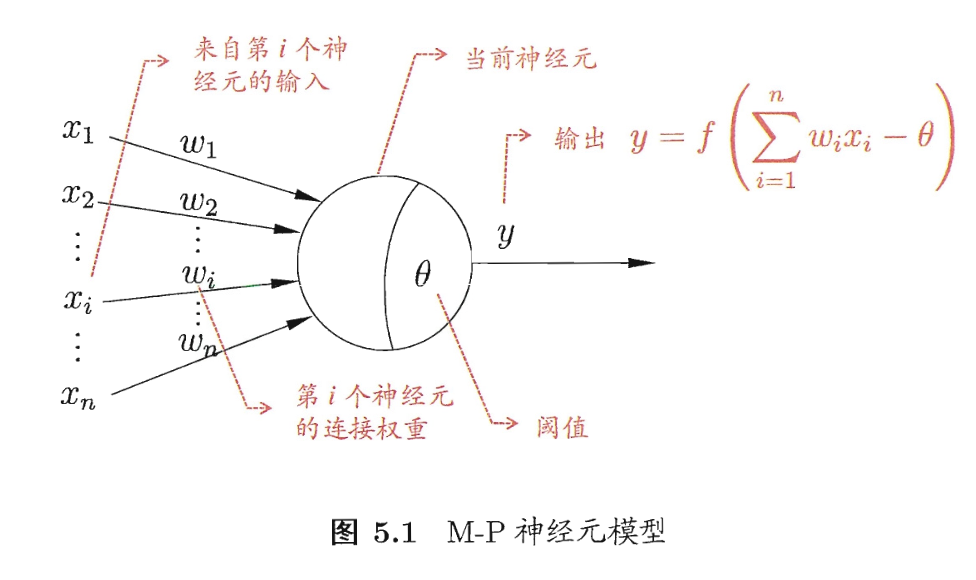
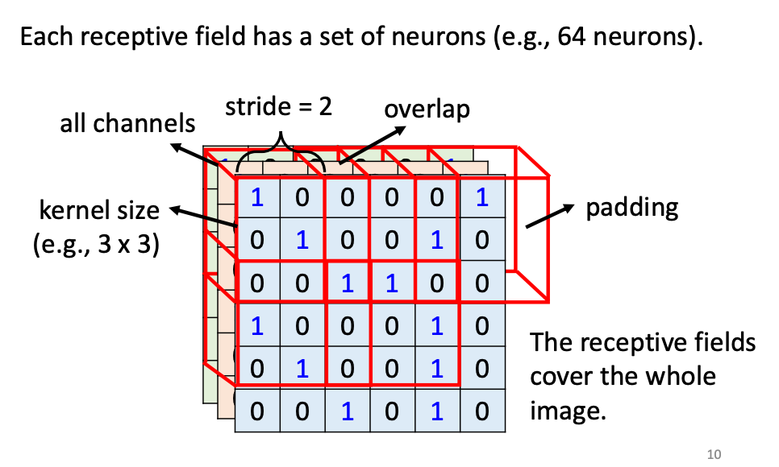
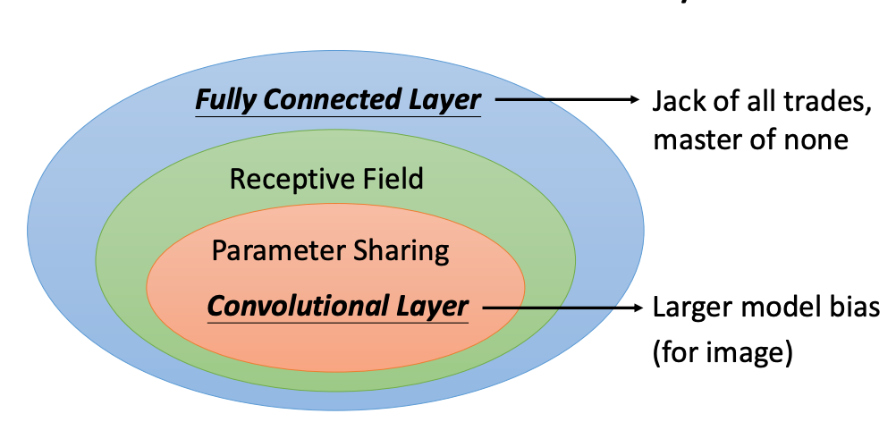

ndex
- Convolutional Neural Networks (CNN) 卷积神经网络
- I used a validation set, but my model still overfitted

# neural networks(神经网络)

neuron(神经元模型)

生物神经网络：其接收到的化学物质如果超过某个阈值，就会被激活，即向别的神经元发送化学物质

M-P神经元模型：
- 接收其他神经元传来的输入信号
- 这些信号通过带权重的连接进行传递
- 总输入值如果超过阈值，就通过激活函数(activation function)，然后输出

激活函数的代表：sigmoid，将数据压到(0,1)内

$$
sigmoid(x)=\frac{1}{1+e^{-x}}
$$

感知机(perception)/阈值逻辑单元(threshold logic unit)：由输入层(接收外界信号)、输出层(M-P神经元)组成。

多层前馈神经网络：输入层、隐层(加工信号)、输出层。

神经网络的学习过程：根据数据来调整神经元之间的连接权(connection weight)、每个功能神经元的阈值。

# Convolutional Neural Networks (CNN)

filter(卷积滤波器)

feature map(特征映射)：一个由多个neuron组成的平面，通过filter提取输入的特征

convolutional layer(卷积层)：由多个feature map组成

pooling(采样层)：在保留有用信息的基础上，减少数据量。

CNN：
- 有多个卷积层、采样层来加工输入信号
- 连接层：实现输入信号与输出目标之间的映射

## image classification

methods to simplify:
- see details, not the whole image -- receptive field
- same patterns appear in different regions -- parameter sharing
- 

1. receptive field

receptive field: 卷积神经网络每一层输出的特征图上的像素点在原始图像上映射的区域大小

receptive fields cover the whole image.

typical settings: 
- kernel size: 3 x 3
- stride(): 
- channels: 

overlap: 超出范围后，就将超出范围的那些标为0（padding）.

Each receptive field has a set of neurons (e.g., 64 neurons)

2. the same patterns may appear in different regions

parameter sharing(共享参数/权共享)：让一组神经元使用相同的连接权

typical settings: each receptive field's neurons share the same set of parameters

stride(移动距离)

the neurons with different receptive fields share the parameters == each filter convolves over the input image.
the shared parameters is called a filter

 
 flatten 

application: CNN for Go playing: 

# I used a validation set(验证集), but my model still overfitted

用普通数据来训练出一些模型，然后用验证集来选出最小loss的那个模型。如果模型数太多，那么用验证集来选择的过程也可能overfitting。

